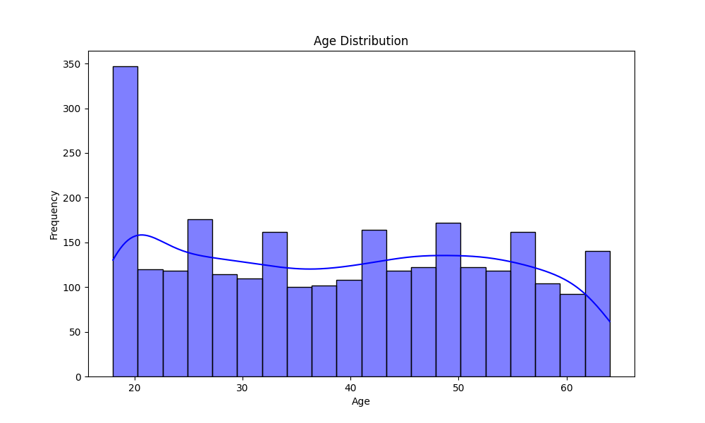
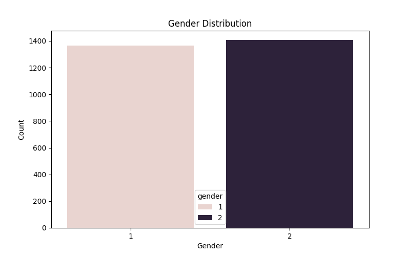
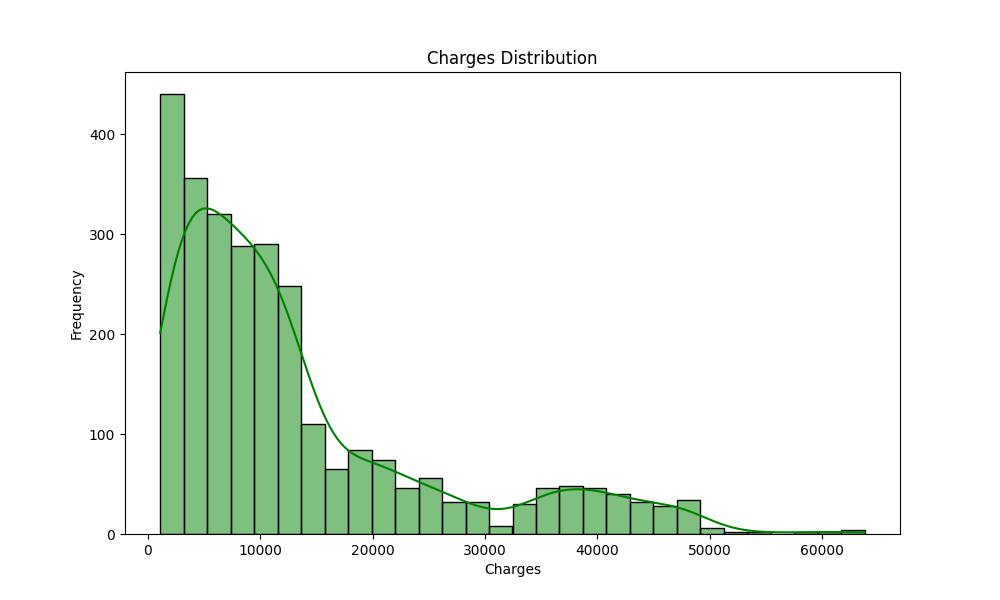
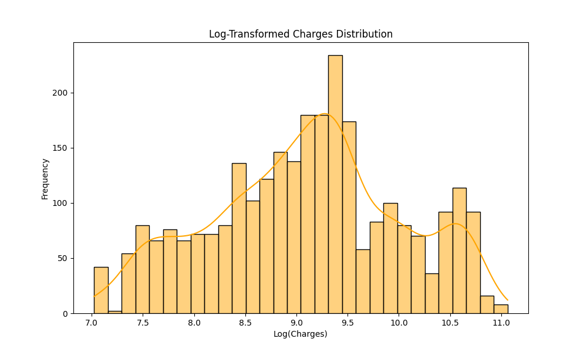
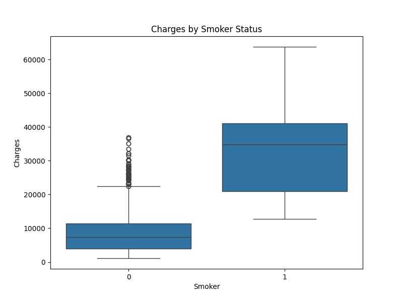
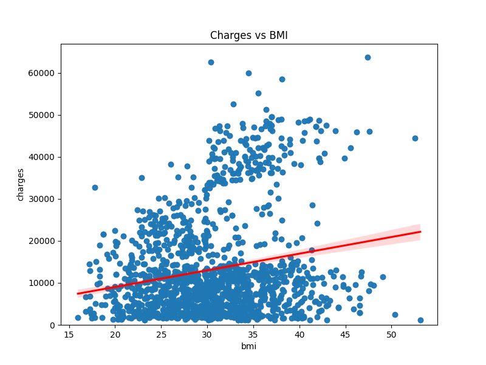
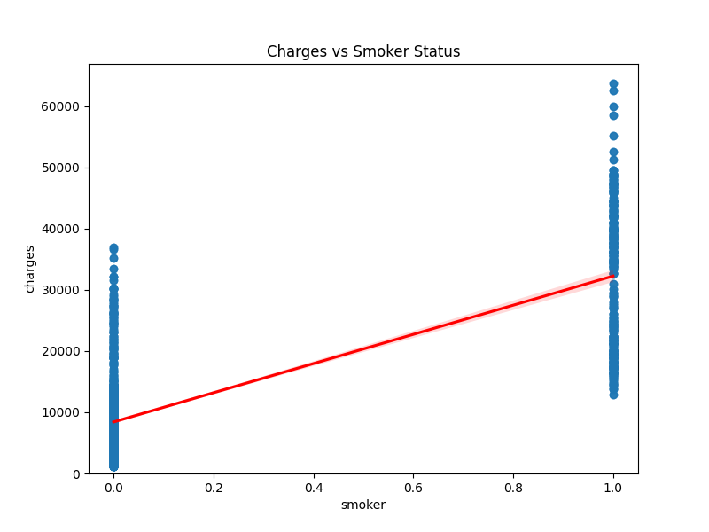

# 🏥 Insurance Cost Analysis – Data Exploration & Modeling

## 📋 Overview
This project explores a **medical insurance dataset** to understand what affects insurance charges.  
We analyze factors like **age, gender, BMI, smoking habits, and region**, perform **data cleaning**, **exploratory analysis**, and build **regression models** to predict charges.  

[Insurance Cost Analysis Notebook](./Data-Analytics-for-Insurance-Cost-Data-Set.ipynb)

Technologies used: **Python, Pandas, Numpy, Seaborn, Matplotlib, Scikit-learn**.

---

## 1️⃣ Task 1: Import Dataset & Initial Exploration
- Dataset loaded from CSV and first 10 rows displayed.
- Column headers renamed to: `['age','gender','bmi','no_of_children','smoker','region','charges']`.
- Missing values (`?`) replaced with `NaN`.

**Purpose:** Understand the dataset structure and identify missing data.

---

## 2️⃣ Task 2: Data Wrangling
- **Identify missing values** using `df.info()`.
- **Handle missing data**:
  - Continuous: Replace missing `age` with mean.  
  - Categorical: Replace missing `smoker` with most frequent value.
- **Update data types** for `age` and `smoker`.
- **Round `charges`** to 3 decimals for clarity.

**Purpose:** Ensure the dataset is clean, consistent, and ready for analysis.

---

## 3️⃣ Task 3: Exploratory Data Analysis (EDA)

### Age Distribution

- Most policyholders are aged 18–40.  
- Age can moderately influence insurance charges.  

### Gender Distribution

- Male and female counts are fairly balanced.  
- Gender alone has minimal impact on charges.  

### Charges Distribution

- Most pay lower premiums; a few high-cost cases stretch the distribution.  

### Log-Transformed Charges

- Log transformation reduces skewness, making it easier to analyze.  

### Charges by Smoker Status

- Smokers pay significantly more.  
- Smoking is a major factor in predicting insurance costs. 🚬💸  

### Charges vs BMI

- Higher BMI generally leads to higher charges, though not perfectly linear.  

### Charges vs Smoker (Regression)

- Confirms that smoker status strongly influences charges. ✅  

**Takeaway:** Smoking, BMI, and age are key drivers of insurance cost.

---

## 4️⃣ Task 4: Model Development
- **Linear Regression** used to predict charges.  
- Initial model: `charges ~ smoker` → simple predictor.  
- Extended model: `charges ~ age + gender + bmi + no_of_children + smoker + region`.  
- **Pipeline** with `StandardScaler` + `PolynomialFeatures` + `LinearRegression` applied.  
- Model performance evaluated using **R² score**.

**Purpose:** Understand relationships and test predictive power of features.

---

## 5️⃣ Task 5: Model Refinement
- Dataset split: 80% training, 20% testing.  
- **Ridge Regression** used to reduce overfitting.  
- Model evaluated with **R² score** on test set.

**Takeaway:** Ridge model helps generalize predictions while accounting for multicollinearity.  

---

## 📝 Conclusion
From the analysis:

- **Age**: Older people generally pay more.  
- **Smokers**: Significantly higher charges than non-smokers.  
- **BMI**: Positive correlation with charges.  
- **Gender & Region**: Less impactful individually but can be considered in models.  

**Bottom line:** Smoking and BMI are the strongest predictors of insurance cost, with age also playing a role. This project shows the full workflow: **data cleaning → visualization → modeling → refinement**.  

---

## 🔧 Notes
- All plots are saved in the `img/` folder and referenced via `` tags.  
- To view images in GitHub or VS Code Markdown, ensure the `img` folder is in the same directory as this README.
